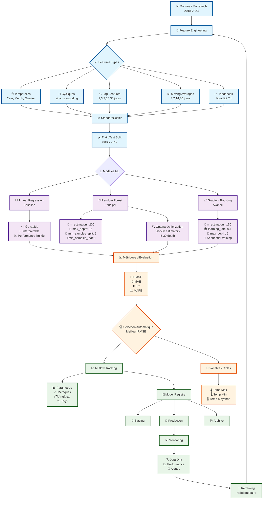
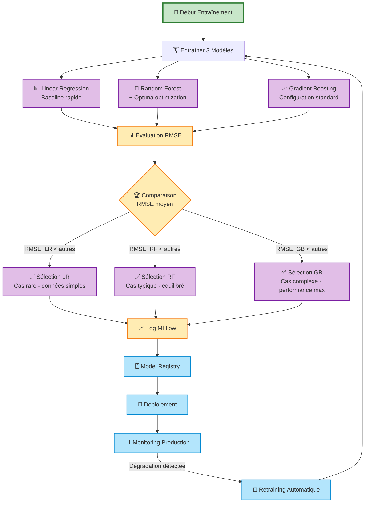

# 📊 Diagramme d'Architecture - Modèles ML Climate MLOps



## 🔄 Pipeline de Données Détaillé

```mermaid
flowchart LR
    %% Raw Data
    A1[📊 CSV Marrakech<br/>2018-2023] --> A2[🧹 Nettoyage<br/>Valeurs manquantes<br/>Outliers]
    
    %% Feature Engineering Steps
    A2 --> B1[⏰ Features Temporelles]
    B1 --> B2[Year: 2018-2023<br/>Month: 1-12<br/>Quarter: Q1-Q4<br/>DayOfYear: 1-365<br/>WeekOfYear: 1-53]
    
    A2 --> C1[🔄 Encoding Cyclique]
    C1 --> C2[Month_sin = sin(2π*month/12)<br/>Month_cos = cos(2π*month/12)<br/>DayOfYear_sin<br/>DayOfYear_cos]
    
    A2 --> D1[📉 Lag Features]
    D1 --> D2[Temp_lag_1: J-1<br/>Temp_lag_3: J-3<br/>Temp_lag_7: J-7<br/>Temp_lag_14: J-14<br/>Temp_lag_30: J-30]
    
    A2 --> E1[📊 Moving Averages]
    E1 --> E2[MA_3: moyenne 3 jours<br/>MA_7: moyenne 7 jours<br/>MA_14: moyenne 14 jours<br/>MA_30: moyenne 30 jours]
    
    A2 --> F1[📈 Features Avancées]
    F1 --> F2[Trend_30d: pente 30j<br/>Volatility_7d: std 7j<br/>Diff_1d: différence J vs J-1<br/>Diff_7d: différence hebdo]
    
    %% Concatenation
    B2 --> G[🔗 Concaténation Features]
    C2 --> G
    D2 --> G
    E2 --> G
    F2 --> G
    
    %% Scaling
    G --> H[⚖️ StandardScaler<br/>μ=0, σ=1]
    
    %% Split
    H --> I[✂️ Train/Test Split<br/>Temporal: avant/après 2022]
    
    %% Final datasets
    I --> J1[🏋️ Train Set<br/>2018-2021<br/>~1460 samples]
    I --> J2[🧪 Test Set<br/>2022-2023<br/>~730 samples]
    
    classDef dataClass fill:#e3f2fd,stroke:#0277bd,stroke-width:2px
    classDef featureClass fill:#f1f8e9,stroke:#33691e,stroke-width:2px
    classDef processClass fill:#fce4ec,stroke:#c2185b,stroke-width:2px
    
    class A1,A2 dataClass
    class B1,B2,C1,C2,D1,D2,E1,E2,F1,F2 featureClass
    class G,H,I,J1,J2 processClass
```

## 📊 Comparaison des Modèles

| Aspect | Linear Regression | Random Forest | Gradient Boosting |
|--------|------------------|---------------|-------------------|
| **Complexité** | ⭐ Faible | ⭐⭐⭐ Moyenne | ⭐⭐⭐⭐ Élevée |
| **Temps d'entraînement** | ⚡ <1 min | 🕐 2-5 min | 🕘 5-15 min |
| **Interprétabilité** | ⭐⭐⭐⭐⭐ Très haute | ⭐⭐⭐ Moyenne | ⭐⭐ Faible |
| **Performance typique** | ⭐⭐ Baseline | ⭐⭐⭐⭐ Excellente | ⭐⭐⭐⭐⭐ Optimale |
| **Résistance overfitting** | ⭐⭐⭐⭐⭐ Très haute | ⭐⭐⭐⭐ Haute | ⭐⭐⭐ Moyenne |
| **Hyperparamètres** | Aucun | 4 principaux | 6+ critiques |
| **Parallélisation** | ❌ Non | ✅ Oui | ❌ Non |
| **Usage recommandé** | Baseline/Debug | Production | Compétition |

## 🎯 Flux de Sélection de Modèle

