# 🏆 Model Selection & Deployment Strategy - Climate MLOps

## 📋 Overview

This document explains how your Climate MLOps project selects the best model after training and decides whether to deploy it to production.

---

## 🔄 Current Model Selection Process

### 1. **Basic Selection (Current Implementation)**

Your project currently uses a **simple RMSE-based selection**:

```python
def compare_models(self, models_results: Dict[str, Dict[str, float]]) -> str:
    # Select model with LOWEST average test RMSE
    best_model_name = min(models_results.keys(), 
                         key=lambda k: models_results[k]['avg_test_rmse'])
    return best_model_name
```

**Selection Criteria:**
- 🎯 **Primary Metric**: `avg_test_rmse` (Average Test Root Mean Square Error)
- 📊 **Logic**: Lower RMSE = Better model
- 📈 **Scope**: Averages across all 3 target variables (temp_max, temp_min, temp_mean)

### 2. **Training Sequence**
1. **Linear Regression** (baseline) → Fast reference
2. **Gradient Boosting** → Advanced model
3. **Random Forest + Optuna** → Optimized candidate
4. **Compare all 3** → Select winner by RMSE

---

## 🚀 Enhanced Selection System (New Implementation)

### 1. **Multi-Criteria Scoring**

The enhanced system uses a **weighted composite score**:

```python
def compare_models_advanced(self, models_results, training_times=None):
    # Weighted scoring system
    MODEL_SELECTION_WEIGHTS = {
        'rmse': 0.4,    # 40% - Primary error metric
        'r2': 0.3,      # 30% - Goodness of fit
        'mae': 0.2,     # 20% - Absolute error  
        'time': 0.1     # 10% - Training speed
    }
    
    # Calculate composite score (0-100)
    composite_score = (
        rmse_score * 0.4 + 
        r2_score * 0.3 + 
        mae_score * 0.2 + 
        time_score * 0.1
    )
```

**Advantages:**
- ✅ **Balanced evaluation** considering multiple aspects
- ✅ **Configurable weights** via environment variables
- ✅ **Time efficiency** factor included
- ✅ **Normalized scoring** (0-100 scale)

### 2. **Deployment Decision Engine**

```python
def should_deploy_model(self, current_results, previous_results=None):
    # Multi-checkpoint validation system
    deployment_checks = {
        'min_performance': current_r2 >= 0.7,           # Minimum quality
        'sufficient_data': test_samples >= 100,         # Data reliability  
        'rmse_improvement': improvement >= 5%,          # Performance gain
        'r2_improvement': r2_gain >= 2%,               # Fit quality gain
    }
    
    # Decision: Deploy if all checks pass
    should_deploy = all(deployment_checks.values())
```

---

## ⚙️ Configuration Options

### Environment Variables for Tuning:

```bash
# Model Selection Weights
MODEL_SELECTION_WEIGHT_RMSE=0.4        # RMSE importance (40%)
MODEL_SELECTION_WEIGHT_R2=0.3          # R² importance (30%)  
MODEL_SELECTION_WEIGHT_MAE=0.2         # MAE importance (20%)
MODEL_SELECTION_WEIGHT_TIME=0.1        # Speed importance (10%)

# Deployment Thresholds
MIN_R2_THRESHOLD=0.7                   # Minimum acceptable R²
MIN_RMSE_IMPROVEMENT=0.05              # 5% RMSE improvement required
MIN_R2_IMPROVEMENT=0.02                # 2% R² improvement required
MIN_DATA_POINTS=100                    # Minimum test samples

# Deployment Strategy
AUTO_DEPLOY=false                      # Require manual approval
MANUAL_APPROVAL=true                   # Human validation needed
SHADOW_MODE_DAYS=3                     # Test period before full deployment
```

---

## 📊 Selection Comparison

| Aspect | **Current System** | **Enhanced System** |
|--------|-------------------|-------------------|
| **Metrics Used** | RMSE only | RMSE + R² + MAE + Time |
| **Weighting** | Equal (33% each target) | Configurable (40% RMSE, 30% R², etc.) |
| **Deployment Logic** | Automatic best RMSE | Multi-criteria validation |
| **Previous Model Compare** | ❌ No | ✅ Yes (improvement required) |
| **Quality Gates** | ❌ None | ✅ Multiple checkpoints |
| **Manual Override** | ❌ No | ✅ Configurable |
| **Time Consideration** | ❌ Ignored | ✅ 10% weight factor |

---

## 🎯 Model Selection Flow

```mermaid
flowchart TD
    Start[🏋️ Training Complete] --> Basic{Use Basic or Enhanced?}
    
    Basic -->|Current| SimpleRMSE[📏 Compare RMSE Only]
    Basic -->|New| Enhanced[📊 Multi-Criteria Scoring]
    
    SimpleRMSE --> SelectSimple[🏆 Lowest RMSE Wins]
    
    Enhanced --> Normalize[⚖️ Normalize Metrics 0-100]
    Normalize --> Weight[🎯 Apply Weights<br/>RMSE:40% R²:30% MAE:20% Time:10%]
    Weight --> Composite[📊 Calculate Composite Score]
    Composite --> SelectBest[🏆 Highest Score Wins]
    
    SelectSimple --> AutoDeploy{Auto Deploy?}
    SelectBest --> QualityGates[🚪 Quality Gates Check]
    
    QualityGates --> MinPerf{R² ≥ 0.7?}
    MinPerf -->|Yes| DataCheck{Enough Data?}
    MinPerf -->|No| Reject[❌ Reject - Poor Performance]
    
    DataCheck -->|Yes| Improvement{Previous Model?}
    DataCheck -->|No| Reject2[❌ Reject - Insufficient Data]
    
    Improvement -->|No Previous| FirstModel[✅ First Model - Deploy]
    Improvement -->|Has Previous| Compare{Improvement ≥ 5%?}
    
    Compare -->|Yes| ApprovalCheck{Manual Approval?}
    Compare -->|No| Reject3[❌ Reject - No Improvement]
    
    AutoDeploy -->|Yes| Deploy[🚀 Auto Deploy]
    ApprovalCheck -->|No| Deploy
    ApprovalCheck -->|Yes| Manual[👤 Await Approval]
    
    Manual --> Deploy
    FirstModel --> Deploy
    Deploy --> ShadowMode[🌙 Shadow Mode 3 Days]
    ShadowMode --> Production[🌟 Full Production]
    
    style Enhanced fill:#e1f5fe
    style QualityGates fill:#fff3e0
    style Deploy fill:#e8f5e8
    style Production fill:#c8e6c9
```



---

## 🛡️ Quality Gates & Safeguards

### 1. **Performance Gates**
- **Minimum R²**: 0.7 (configurable)
- **RMSE Improvement**: 5% minimum vs previous model
- **Data Volume**: 100+ test samples minimum

### 2. **Stability Checks** 
- **Training Time**: Must be < 1 hour
- **Model Consistency**: Repeated runs should be stable
- **Feature Importance**: Logical feature ranking

### 3. **Deployment Safeguards**
- **Shadow Mode**: 3 days parallel testing
- **Rollback Capability**: Instant revert if issues
- **Manual Override**: Human can pause/approve
- **Monitoring Alerts**: Performance degradation detection

---

## 📈 Usage Examples

### Example 1: Enhanced Selection
```python
# Train models
trainer = WeatherModelTrainer()
results = trainer.run_full_training()

# Enhanced comparison (if training times tracked)
training_times = {
    'LinearRegression': 30.5,      # seconds
    'GradientBoosting': 180.2, 
    'RandomForest': 95.8
}

enhanced_results = trainer.compare_models_advanced(
    models_results, training_times
)

print(f"Best Model: {enhanced_results['best_model']}")
print(f"Composite Score: {enhanced_results['best_score']:.1f}/100")
```

### Example 2: Deployment Decision
```python
# Check if model should be deployed
previous_results = load_previous_results()  # From last training
deployment = trainer.should_deploy_model(current_results, previous_results)

if deployment['should_deploy']:
    print("✅ DEPLOY TO PRODUCTION")
    deploy_model(deployment['model_name'])
else:
    print("❌ DO NOT DEPLOY")
    for reason in deployment['reasons']:
        print(f"  {reason}")
```

---

## 🔧 Customization Guide

### 1. **Adjust Selection Weights**
```python
# In config.py or environment
MODEL_SELECTION_WEIGHTS = {
    'rmse': 0.5,    # Prioritize accuracy
    'r2': 0.3,      
    'mae': 0.1,     # Less weight on MAE
    'time': 0.1     # Keep speed consideration
}
```

### 2. **Modify Quality Thresholds**
```python
MODEL_PROMOTION_CRITERIA = {
    'min_r2_threshold': 0.8,           # Stricter quality requirement
    'min_rmse_improvement': 0.03,      # 3% improvement sufficient
    'require_positive_tests': False,   # Allow partial compliance
}
```

### 3. **Enable Auto-Deployment**
```bash
# For high-confidence environments
export AUTO_DEPLOY=true
export MANUAL_APPROVAL=false
export SHADOW_MODE_DAYS=1  # Shorter testing period
```

---

## 🏆 Best Practices

### For Production Use:
1. **Start Conservative**: Use manual approval initially
2. **Monitor Closely**: Watch shadow mode performance
3. **Gradual Automation**: Enable auto-deploy after confidence builds
4. **Regular Review**: Adjust weights based on business priorities

### For Development:
1. **Favor Speed**: Increase time weight for faster iterations
2. **Lower Thresholds**: Allow more experimental deployments  
3. **Enable Auto-Deploy**: Reduce manual overhead

### For Critical Applications:
1. **Strict Quality Gates**: Higher R² thresholds
2. **Require All Checks**: `require_positive_tests: true`
3. **Extended Shadow Mode**: 7+ day testing period
4. **Multiple Human Approval**: Additional safeguards

---

*📅 Last Updated: December 13, 2025*  
*🔄 Version: 2.0*  
*👥 Enhanced Model Selection & Deployment System*